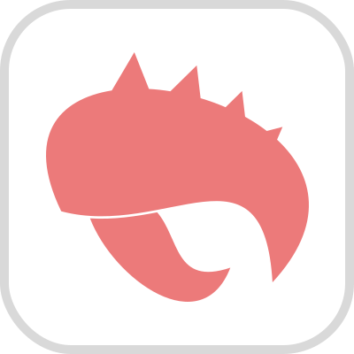

# Claw

Notice: **This framework is under development**

Claw is a CSS framework that helps you quickly create the basic structure of a website with the necessary components on your server.

Example: [https://etozhejuicy.github.io/claw/](https://etozhejuicy.github.io/claw/)

#### The status of utility readiness:

- [x]  align
- [ ]  colors
- [x]  border
- [x]  cols
- [x]  container
- [x]  dimensions
- [x]  display
- [x]  filter
- [x]  flexbox
- [ ]  grid
- [x]  icons
- [x]  margin
- [x]  object-fit
- [x]  object-position
- [x]  opacity
- [x]  order
- [x]  overflow
- [x]  padding
- [x]  pointer-events
- [ ]  placeholder
- [x]  prefix
- [x]  positions
- [x]  ratio
- [x]  rounded
- [x]  responsive
- [x]  stretched-link
- [x]  text
- [ ]  variables
- [x]  visibility
- [x]  z-index

#### The status of components readiness:

- [ ]  background
- [x]  badge
- [ ]  buttons
- [ ]  cards
- [ ]  checks, radios & switches
- [ ]  code & quote
- [ ]  counter
- [ ]  devider
- [ ]  forms
- [ ]  groups & stacks
- [ ]  links
- [ ]  list
- [ ]  modals
- [ ]  popover
- [ ]  progressbar
- [ ]  range
- [ ]  select
- [ ]  shadow
- [ ]  spinners
- [ ]  stretched
- [ ]  table
- [ ]  tabs
