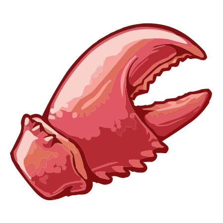

# Claw

Notice: **I'm doing a complete redesign of the framework**

Some components, modules, or utilities may simply not work or may not display correctly in your interface. Please wait for version 0.2 when it is ready.

Example: [https://etozhejuicy.github.io/claw/](https://etozhejuicy.github.io/claw/)

#### The development status is temporarily hidden due to technical issues. The framework will become even easier, thanks to new simplified objects and models in styles.