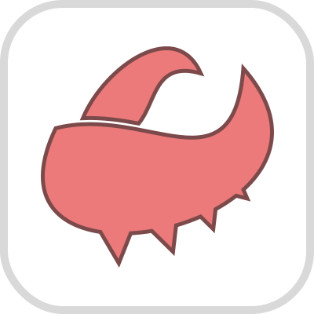

# Claw

Claw is a CSS framework that helps you quickly create the basic structure of a website with the necessary components on your server.

Example: [https://etozhejuicy.github.io/claw/](https://etozhejuicy.github.io/claw/)

#### The status of utility readiness:

- [x]  align
- [ ]  colors
- [x]  border
- [ ]  cols
- [x]  container
- [x]  dimensions
- [x]  display
- [x]  filter
- [x]  flexbox
- [ ]  grid
- [x]  icons
- [x]  margin
- [x]  object-fit
- [x]  object-position
- [x]  opacity
- [x]  order
- [x]  overflow
- [x]  padding
- [x]  pointer-events
- [ ]  placeholder
- [x]  prefix
- [x]  positions
- [x]  ratio
- [ ]  radius
- [x]  responsive
- [x]  stretched-link
- [x]  text
- [ ]  variables
- [ ]  visibility
